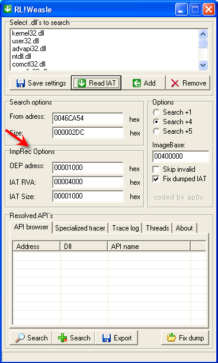

# Глава 51 - Распаковка ASProtect v2.3.04.26a. Часть 1

В этой главе мы кое-что изменим, и я думаю, что так будет лучше: теперь распаковка будет интерактивной. Однако это не означает, что Введение заканчивается — далее мы просто затронем другую тему, но прежде я сделаю так, чтобы вы немного поработали. В данном туториале мы интерактивно распакуем последнюю на сегодняшний день версию ASProtect’а. Я буду делать самое легкое, а вы — самое трудное, хе-хе.

Файл UnPackMe\_ASProtect.2.3.04.26.a.exe ***\[[ссылка](files/51/UnPackMe_ASProtect.2.3.04.26.a.7z)\]*** не снабжен всей защитой, то есть это довольно простая версия протектора. Стоит лишь заметить, что если при попытке дойти до OEP появится сообщение об ошибке защиты, то следует скопировать файл в другое место, где он будет функционировать нормально. Или же, если в папке есть несколько файлов с различными именами и один из них начнет досаждать сообщениями об ошибке защиты и перестанет запускаться, то следует запустить другой, а затем прежний: если после этого ошибка исчезнет, то будет ясно, почему, хе-хе.

Кроме того, мы воспользуемся двумя новыми плагинами — OllyBonE ***\[[ссылка](files/51/ollybone-0.1.7z)\]*** и Weasle ***\[[ссылка](files/51/weasle.7z)\]***. В описании OllyBonE сказано:

*Installation:*

*Copy ollybone.dll and i386/ollybone.sys to your OllyDbg directory.*

То есть нужно скопировать файл ollybone.dll в папку для плагинов и ollybone.sys в программную папку OllyDbg. Если это одна и та же папка, то оба файла следует скопировать в нее.

На скриншоте показана папка Olly и новый SYS-файл в ней, а DLL’ка скопирована в папку с плагинами (в моем случае это C:\\Plugins).

Что касается Weasle, то в руководстве к оригинальному пакету говорится, что при использовании модифицированного OllyDbg следует распаковать DLL’ку с помощью UPX 2.01 (мы уже видели, что эта программа также и распаковывает). Я сделал это заранее и приложил к статье готовую к использованию DLL’ку. Файл Importer.dll копируется в папку Olly, как видно на скриншоте, а RL!Weasle.dll — в папку с плагинами.

С ASProtect’ом нужно быть осторожным, поскольку он нередко обнаруживает установленные BP или HB, и тогда начинаются песни об ошибке защиты и приходится производить замену экзешника. Поэтому для достижения OEP мы воспользуемся OllyBonE — плаги­ном, который посредством SYS-драйвера симулирует установку BREAKPOINT ON EXECUTION, что мы видели в версии OllyDbg, пропатченной для поиска OEP’ов, однако данный плагин позволяет дойти до OEP гораздо быстрее. Его недостаток в том, что брейк можно устанавли­вать только в секциях EXE-файла, и для Visual Basic’а он не годится. Тем не менее он хорош для поиска OEP, и мы им воспользуемся, но сначала снимем одну галку в окне настроек исключений, иначе он работать не будет:

Остальные галки должны быть установлены, чтобы нам было проще добраться до цели. *\[У меня плагин заработал только после отключения списка добавленных исключений.\]*

После запуска программа остановилась в первой секции, поэтому до установки break-on-execute придется трассировать несколько строк с помощью F7 вплоть до выхода из нее:

Теперь программа находится вне первой секции и можно устанавливать break-on-execute в карте памяти:

Остановка произошла здесь:

В любом другом упаковщике это была бы OEP, но ASProtect всегда выполняет RET и возвращается в область кода распаковщика. Снимем break-on-execute:

Для выхода из первой секции нажмем F7, и, повторно установив break-on-execu­te, — RUN.

Теперь, оказавшись на OEP *\[см. [Дополнение](#addition) в конце главы\]*, следует вспомнить, что это было обеспечено специальным драйвером и для дальнейшей трассировки или выполнения программы нужно снять break-on-execute, иначе нам придется повторить всё с начала. Запомните это!

Хорошо, теперь сдампим процесс с помощью OllyDump ***\[[ссылка](files/35/OllyDump%20v3.00.110.7z)\]***, не забыв снять галку с Rebuild Import:

Затем отыщем начало и конец IAT’а. В листинге есть вызов API-функции, аргумент которого похож на адрес верного элемента IAT’а:

Если подняться, можно найти начало IAT - 460818:

А если спуститься, то и ее конец - 460F28:

Таким образом, имеем:

OEP = 4271B0

IAT = 460818

Size IAT = 710

Но на этот раз для восстановления IAT’а вместо ImpRec’а воспользуемся Weasle ***\[[ссылка](files/51/weasle.7z)\]***. Посмотрим, поможет ли он нам.

Введем найденные данные в поле "ImpRec Options":

Кроме того, нужно скопировать начальный адрес IAT и ее размер в поля "From address" и "Size" области "Search options" и установить переключатель "Options" в положение "Search +1". По идее, этого должно быть достаточно для нормального считывания, однако когда я пользовался этим плагином, часто какая-либо DLL’ка оказывалась пропущенной, например, DLL’ка последнего элемента. Но это не проблема — ее можно добавить с помощью кнопки Add. Посмотрим соответствующий референс в Olly:

Как видно из скриншота, это oledlg.dll, которая отсутствует в верхнем списке, отображающем используемые в программе DLL’ки. Как правило, в таком случае я нажимаю кнопку Add и ввожу "oledlg.dll", а затем повторно нажимаю Search, и проблема исчезает. Следует помнить, что это только бета-версия плагина, т.е. у него могут быть баги. Посмотрим, насколько хорошо он произведет восстановление, ведь мы отнюдь не собираемся дожидаться релиза, хе-хе:

Теперь сообщается, что найдено 429 из 429. Запустим восстановленный дамп:

Ах, не хватило малой детали! Зато стало ясно, что вызовы ntdll плохо обрабатываются; в плагине есть опция, исправляющая это, и ее нужно всегда применять:

Теперь следует удалить только что полученный экзешник и восстановить прежний дамп, сменив расширение .bak на .exe. Если снова применить "Fix dump", то всё будет восстановлено, хотя программа и в этом случае не запустится, поскольку она исковеркана антидампами. Но дальнейшую работу придется выполнить уже вам по приведенному ниже плану.

У нас есть дамп, восстановленный с помощью Weasle и полностью исправленная IAT. Однако посмотрим Search for –> All intermodular calls:

CALL’ы на один и тот же адрес (019B0000 на моем компьютере) — это антидампы, поскольку такой адрес отсутствует в созданном нами файле.

Ниже привожу домашнее задание, а чтобы вы не пугались, дам несколько подсказок.

Если вы захотите написать скрипт для исправления антидампов, то это нужно сделать в течение 15 дней. Все полученные мной скрипты я проверю, а в следующей главе упомяну автора полностью рабочего скрипта, который мне покажется наиболее простым и эффективным.

В качестве помощи вы можете воспользоваться распакованными нами ранее программами, чтобы посмотреть, к какой API-функции ведут CALL’ы в каждом случае. Скрипт должен функционировать в оригинальной программе, остановленной на OEP, и восстанавливать все эти CALL’ы полностью, чтобы затем можно было вручную скопировать с помощью Binary copy в дамп целую секцию, после чего он должен запуститься. Скрипт должен работать на любом компьютере, поскольку я буду испытывать его у себя. Если за 15 дней данную задачу никто не решит, мне придется сделать это самому, однако надеюсь, что до такого дело не дойдет, хе-хе. Вместе со скриптом следует выслать свое имя или ник. Победитель будет назван в 52-й главе, ибо думаю, что он того заслуживает за такую кропотливую работу.

Уточню еще раз: скрипт должен восстанавливать эти CALL’ы в оригинальной программе, но при этом не производить окончательных Binary copy/Binary paste, поскольку я намереваюсь сделать это вручную. Он должен исправлять вызовы таким образом, чтобы после Copy/Paste дамп работал нормально.

А теперь — подсказка. Посмотрим оригинальную программу, остановленную на OEP:

Если взглянуть на это же место в восстановленном нами дампе, то там инструкции окажутся другими. Вот тот же самый вызов в дампе:

Здесь CALL вызывает API-функцию (в данном случае — GetStartupInfoA), и возврат из нее происходит по адресу 4272DB (так как это 6-байтовая команда). В защищенной ASProtect’ом программе возврат должен происходить по тому же самому адресу. Дело в том, что он заменяется 5-байтовой командой (а 6-й байт — мусорным), и если установить BP на адрес возврата из CALL’а в упакованной ASProtect’ом программе, то он всегда будет на один байт больше адреса показанной нам в листинге следующей инструкции; в данном случае следующая команда отображена так:

004272D5 E8 268D5801 CALL 019B0000

004272DA D9F6 FDECSTP

Чтобы произошла остановка после возврата из API-функции, следует установить BP на 4272DB. Если трассировать вручную, то можно и поседеть, поэтому при решении данной задачи следует использовать брейки BPM. В какой-то момент своей работы программа должна считать и скопировать байты API-функции в другое место, поэтому следует установить BPM ON ACCESS на первые команды API-функции (GetStartupInfoA в данном случае). Так находится момент считывания правильной API-функции на данном компьютере. Потом нужно найти момент перезаписи инструкции CALL 019B0000, так как после считывания байтов API-функции они копируются в другое место, где и происходит их выполнение. С помощью BPM ON WRITE можно найти момент, когда CALL 19B0000 заменяется CALL’ом в это новое место. Затем останется лишь задействовать скрипт, восстанавливающий CALL: он просто заменит байты, которые должны были сохраниться, правильными, хе-хе.

Такова задача, посмотрим, кто выполнит ее лучше всех. Вам придется немало подумать и хорошо потрудиться, чтобы ваш скрипт работал на любом компьютере. Надеюсь, кто-нибудь решит эту задачу до 17 августа 2006.

Кроме имени победителя и рассмотрения его скрипта, в качестве утешительного приза я упомяну также и именах всех приславших мне рабочие скрипты.

Удачи и Good work!

\[C\] Рикардо Нарваха, 02.08.06 пер. Рома Стремилов, 05.2010

# Дополнение

Поскольку в данном анпэкми с попаданием на OEP и с плагином OllyBonE сопряжен ряд трудностей, привожу переписку Рикардо с читателями этой главы и его посты на форуме RCE в отдельном файле.

Ralba:

> Несмотря на то, что я делаю всё в точности как сказал маэстро в 51-й главе, не могу дойти даже до OEP. После установки break-on-execute мне выдаются два сообщения об ошибке, одно (не самое злостное) — Error 45, а от второго волосы дыбом встают. Такое впечатление, что процессор вот-вот из материнки выскочит, хе-хе. И это не считая того, что я не могу запустить данную версию ASProtect’а из Проводника простым двойным кликом! Так происходит только со мной или есть и другие? Я уж и копировал в различные места на жестком диске, чтобы изменить путь, но всё без толку…

Рикардо Нарваха:

> Этот упаковщик весьма чувствителен из-за RDTSC. Если он не запускается вне отладчика, то в Olly будет работать еще меньше.

OtupAtpaxa:

> Этот упаковщик — однозначно гадина в высшей степени, хотя, согласно Рикардо, это наименее защищенная версия. У меня на него почти весь вечер уходит — проще будет написать скрипт, чем заставить его дойти до OEP! Из 20-ти попыток дойти до OEP удается 1, и ничего с этим не поделаешь. Он просто перемалывает меня в своих жерновах! Кроме того, данный анпэкми, как верно заметил Ralba, не только не работает в Olly, но и не запускается двойным кликом в Windows’е. Я крайне разочарован. Надеюсь, кто-нибудь поможет с ним разобраться :-)

Рикардо Нарваха:

> Если анпэкми не запускается вне отладчика, нужно скопировать его в другую папку, и там должен заработать. Пробовал новую версию Olly Advanced с включенным драйвером Anti-RDTSC fakerdtsc (метод 1)? Однажды я никак не мог запустить программу; перезагрузил, и проблема исчезла.

DAMIAN:

> Otup, это потому что ты не пробовал приаттачиться. <…>
>
>dapaf

OtupAtpaxa:

> Привет, Рикардо! Изменять папки я попробовал, однако результат всегда эвристический: 2 раза программа запускается, а 8 раз — нет… Большое спасибо за файлы, отправленные тобой этим вечером, но я их еще не смотрел. Надеюсь, завтрашний день будет более удачным.
>
>dapaf, твоя идея, конечно, хороша, но у меня приаттачиться не получается… Полагаю, что если есть возможность присоединиться к запущенному (и остановленному) процессу, то можно будет дойти до какого-нибудь вызова антидампа. Это, конечно, лучше, чем ничего.

Рикардо Нарваха:

> Я бы сказал, что проблема скорее в процедуре антидампа, которая переписывает API-функцию из DLL’ки в созданную упаковщиком область памяти и модифицирует уже выполненный CALL, чтобы он указывал на эту область и чтобы после его выполнения было сложно идентифицировать API-функцию, поскольку он больше на нее не указывает. По-мое­му, трудность заключается именно в этом.

Ralba:

> Простите, маэстро, но что такое RDTSC?

Рикардо Нарваха:

> Инструкция RDTSC позволяет определять число циклов, прошедших с момента включения компьютера и может использоваться подобно GetTickCount для определения промежутка времени между двумя вызовами команды, что и применено в исследуемом ASProtect’е, но не два, а несколько раз. Эта команда осложняет процесс взлома и перехват API-функций, поскольку во время ручной трассировки каждый раз при проходе через RDTSC происходит приостановка выполнения, а это влияет на результат и далее начинаются проблемы. В те времена, когда еще не было драйверов Anti-RDTSC, приходилось останавливаться на командах RDTSC (с помощью пошаговой трассировки, либо ища во всём коде инструкции RDTSC и устанавливая на каждую BP, либо запуская условную трассировку Trace into с остановками на RDTSC), а затем после выполнения инструкции изменять значения регистров EAX и EDX, обнуляя или сокращая период времени между двумя вызовами. Теперь же появились специальные драйверы, входящие в состав Olly Advanced под названием Anti-RDTSC (fakerdtsc) — они изменяют в нулевом кольце свойства инструкции, чтобы блокировать ее работу в третьем. Данные драйверы изменяют один флаг, и это дает нам возможность работать с программой в Ring3. Таким образом, если в OllyDbg не задействовать драйвер Olly Advanced fakerdtsc, программа выполняться не будет. Могу предположить, что иногда она будет отказываться выполняться, если время вычислено очень точно. Так бывает, когда программисты предпринимают отчаянные антиотладочные меры.

OtupAtpaxa:

> Привет, Рикардо! Действительно, с последней версией Olly Advanced программа работает немного лучше. Архив fakerdtsc.rar теперь уже не столь актуален, так как он содержит файл fakerdtsc.sys, создаваемый во время работы Olly. <…> Спасибо.

Рикардо Нарваха:

> Я добавил несколько файлов, которые можно скачать по прежней ссылке — это конфигурация Olly Advanced, необходимая для сокрытия отладки, поскольку заставить программу выполняться в Olly довольно трудно, а в туториале об этом было сказано недостаточно. Поэтому я перебрал комбинации настроек плагина и в конце концов заставил анпэкми работать. Я использовал Hide Debugger 1.24 ***\[[ссылка](files/19/HideDebugger124.7z)\]*** со всеми установленными галками и Olly Advanced ***\[[ссылка](files/50/OllyAdvanced-1.26-beta10.7z)\]***, настроенный как показано на скриншотах ***\[[ссылка](files/51/CONFIGURACION.DEL.OLLY.ADVANCED.para.este.asprotect.7z)\]***. Если у вас и теперь программа не работает, то вам придется найти свою собственную конфигурацию плагина таким же образом, как это сделал я — просто удаляя и устанавливая галки, хе-хе.

*Перевод с испанского: Рома Стремилов, 05.2010*
