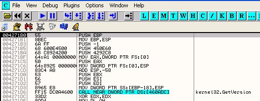
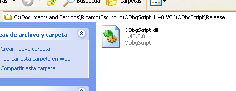
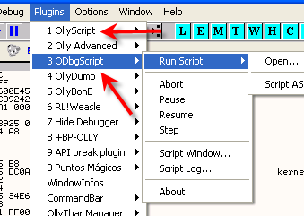
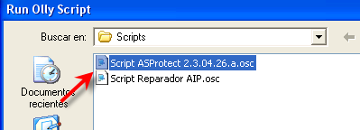
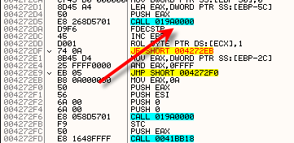
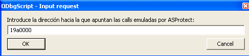
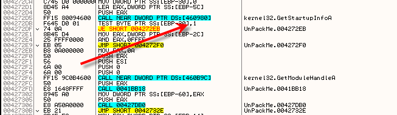
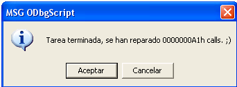
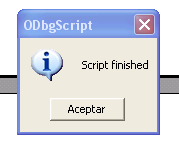

# Глава 52 - Распаковка ASProtect v2.3.04.26a. Часть 2

Конкурс завершился, но из-за его трудности в нем приняли участие немногие. Однако победитель всё же объявился — им стал Hiei, написавший скрипт для восстановления CALL’ов в крэкми ASProtect из предыдущей части.

Хотелось бы отметить, что многие ASProtect’овые анпэкми не работают в отладчике даже с установленным плагином Olly Advanced ***\[[ссылка](.gitbook/assets/files/50/OllyAdvanced-1.26-beta10.7z)\]***, поскольку при включении драйвера Anti-RDTSC программа работает не на всех компьютерах, а без него анпэкми и вовсе отказывается выполняться. Я заметил, что в последней версии ASProtect’а, примененной в нескольких программах, данная защита не установлена и такие программы в OllyDbg работают нормально. По крайней мере, я еще не видел программ, использующих ее и нуждающихся в Anti-RDTSC для своей работы. Вероятно, это связано с проблемами совместимости, и данная защита снята полностью или ее использование сокращено до минимума из-за ее крайней проблематичности.

У кого же драйвер RDTSC Olly Advanced функционирует нормально, те могут легко дойти до OEP, а затем запустить скрипт, приложенный к данному туториалу.



Это OEP, но при попытке запустить скрипт Hiei выдается сообщение, что установленная версия OllyScript устарела и ее надо обновить, поэтому пришлось искать новую, которая теперь называется ODbgScript. Этот проект продолжает развивать Epsylon, так как его первый автор SHaG больше им не занимается.

Скопируйте в папку с плагинами приложенную к статье DLL’ку ***\[[ссылка](.gitbook/assets/files/52/ODbgScript.1.48.VC6.7z)\]***:



А затем перезапустите Olly и снова дойдите до OEP. Не забудьте деактивировать Break-on-execute, иначе из-за него возникнут проблемы.



Хотя это всего лишь новая версия OllyScript’а, в меню отображаются оба плагина, поэтому следует выбрать новый и в нем открыть скрипт  Hiei ***\[[ссылка](.gitbook/assets/files/52/Scripts%20(52).7z)\]***:



Сразу же после запуска запрашивается адрес, на который направляют проблемные CALL’ы, — на моем компьютере это 19A0000:





После нажатия на OK скрипт начинает свою работу, а немного позже наблюдаем результат:







На скриншоте показан CALL, который раньше указывал на 19A0000 (так на моем компьютере), а теперь он восстановлен вместе со всеми остальными. Hiei вполне справился с поставленной задачей, поздравляю!

Вот скрипт, содержащий комментарии самого автора, а далее привожу мои собственные:

```assembly
\*
-=============================================================-
.:[CracksLatinoS]:.
Автор скрипта: Hiei
Назначение: удаление защиты AIP в ASProtect SKE v2.3
Исследуемая программа: UnPackMe_ASProtect.2.3.04.26.a.exe
Конфигурация: ODbgScript v1.3x или выше; запуск из OEP; пропуск
всех исключений
Дата: 5 августа 2006
- = [Комментарий] = -
Благодарности: Рикардо Нарвахе и marciano (ибо я слегка
воспользовался его логикой для написания поискового движка)
-=============================================================-
*/

var oep
var codebase
var codesize
var base_aspr
var base_aip
var ini_iat
var dir
var dir_iat
var sig
var dest
var api
var cont

cmp $VERSION,"1.30" // Проверка версии OllyScript’а.
jb err_version
ask "Введите основание, на которое ссылаются эмулирующие CALL’ы ASProtect’а:"
cmp $RESULT, 0
je salir
mov base_aip, $RESULT // Сохранение введенного адреса.
mov oep, eip // Сохранение значения OEP.
gmi eip, codebase // Определение начального адреса секции кода.
mov codebase, $RESULT // Сохранение полученного значения.
gmi eip, codesize // Определение размера секции кода.
mov codesize, $RESULT // Сохранение полученного значения.
add codesize, codebase // Сложение размера и нач. адреса.
mov ini_iat, 460814 // Сохранение адреса начала IAT.
mov base_aspr, [46C048] // В 46C048 сохранено основание секции, где определяется, к каким API-функциям должны направлять CALL’ы.
add base_aspr, 3B02E // К этому основанию добавляется константа для получения адреса, по которому видна API-функция.
bphws base_aspr, "x" // Установка HBP на адрес, где видна API-функция.
jmp buscar

buscar:
find codebase, #E8????????# // Поиск CALL’ов в секции кода.
cmp $RESULT, 0 // Если ни одного CALL’а не найдено, процесс завершается.
je no_calls
mov dir, $RESULT // При обнаружении CALL’а его адрес сохраняется.
mov sig, dir // Копирование найденного адреса в другую переменную.
mov dest, dir // Копирование в еще одну переменную.
add sig,5 // sig содержит адрес инструкции, следующей за CALL’ом.
inc dest // dest инкрементируется для получения опкодов после E8.
mov dest, [dest] // Извлекается offset, закодированный в CALL’е после опкода E8
add dest, sig // Теперь dest содержит адрес, к которому ведет CALL.
cmp dest, base_aip // Этот CALL есть в ASProtect’е?
je ejecutar
inc dir // Если нет, обновляется указатель поиска.
mov codebase, dir // Указатель копируется и поиск повторяется.
jmp buscar

ejecutar: // CALL ведет к Аспру.
mov eip, dir // В EIP копируется адрес найденного CALL’а, ведущего в Аспр,
run // и программа запускается.
eob comprobar // Если срабатывает BP, управление передается на метку 'comprobar'.

comprobar:
cmp eip, base_aspr // BP находится в ожидаемой области?
jne inesperado
mov api, edx // Если да, то из EDX сохраняется значение API-функции.
jmp buscar_api // Далее — поиск API-функции в IAT’е.

buscar_api:
cmp ini_iat, 460F28 // Начало и конец IAT’а равны?
je error // Если да, то API-функция в IAT’е не найдена.
cmp [ini_iat], api // Поиск API-функции по значению указателя.
je reparar // Если API-функция найдена, то ее надо восстановить.
add ini_iat, 4 // Если нет — увеличить указатель на 4 во избежание ошибок поиска.
jmp buscar_api // Продолжить поиск.

reparar:
mov dir_iat, ini_iat // Сохранение адреса IAT, где найдена API-функция.
ref dir // Поиск ссылок на этот адрес.
cmp $RESULT, 0 // Если ссылка есть, то нужно ассемблировать JMP.
jne reparar_jump
eval "Call dword[{dir_iat}]" // В противном случае — CALL.
asm dir, $RESULT
inc cont // Счетчик для учета кол-ва восстановленных CALL’ов.
inc dir
mov codebase, dir
mov ini_iat, 460814 // Обновление указателя, чтобы следующий поиск производился с начала IAT’а.
jmp buscar

reparar_jump:
eval "Jmp dword[{dir_iat}]" // Ассемблирование JMP’а.
asm dir, $RESULT
inc cont
inc dir
mov codebase, dir
mov ini_iat, 460814 // Обновление указателя, чтобы следующий поиск производился с начала IAT’а.
jmp buscar

inesperado:
msg "Произошла внезапная остановка. Продолжить?"
cmp $RESULT, 0
je salir
run

error:
eval "Ошибка. Следует вручную восстановить CALL по адресу: {dir}h"
msg $RESULT
run

no_calls:
bphwc base_aspr
eval "Работа завершена. Восстановлено {cont}h CALL’ов ;)"
msg $RESULT
jmp salir

err_version:
msg "Ошибка. Требуется более новая версия OllyScript’а"
ret

salir:
bphwc base_aspr
mov eip,oep
ret
```

Думаю, что комментарии, приведенные в самом скрипте, вполне достаточно описывают его работу. Обнаружение процедуры ASProtect’а, определяющей, какая API-функция должна использоваться, работает на любом компьютере, и при этом рекомендованные мной BPM’ы не задействованы.

Здесь происходит извлечение основания секции, созданной процедурой ASProtect’а:

```assembly
mov base_aspr,[46C048] // В 46C048 сохранено основание секции, где определяется, к каким API-функциям должны направлять CALL’ы.
add base_aspr,3B02E // К этому основанию добавляется константа для получения адреса, по которому видна API-функция.
bphws base_aspr,"x" // Установка HBP на адрес, где видна API-функция.
jmp buscar
```

По адресу программы 46C048 сохранена база той секции, где определяется API-функция. После извлечения база суммируется с константой, и так находится ключевое место на любом компьютере, потому что секции равны, а варьируется лишь начальный адрес. В данном случае ключевое место — 3B02E от начала, и после его вычисления на нем устанавливается HBP для остановок при выполнении.

Затем под меткой buscar происходит поиск всех CALL’ов от начала секции 401000 и определяется, какие из них ведут в область ASProtect’а по введенному нами значению.

```assembly
ejecutar: // CALL ведет к Аспру.
mov eip,dir // В eip копируется адрес найденного CALL’а, ведущего в Аспр,
run // и программа запускается.
eob comprobar // Если срабатывает BP, управление передается на метку 'comprobar'.
```

Здесь предусмотрена проверка BP на случай, если кто-нибудь забыл удалить отработанный BP или Break-on-execute, что могло привести к исключениям и нарушению в работе скрипта:

```assembly
comprobar:
cmp eip,base_aspr // BP находится в ожидаемой области?
jne inesperado
mov api,edx // Если да, то из EDX сохраняется значение API-функции.
jmp buscar_api // Далее — поиск API-функции в IAT’е.
```

Если это ожидаемая область (то есть место, показывающее API-функцию), то в IAT’е должен быть элемент, соответствующий найденной API-функции.

```assembly
buscar_api:
cmp ini_iat, 460F28 // Начало и конец IAT’а равны?
je error // Если да, то API-функция в IAT’е не найдена.
cmp [ini_iat],api // Поиск API-функции по значению указателя.
je reparar // Если API-функция найдена, то ее надо восстановить.
add ini_iat,4 // Если нет - увеличить указатель на 4 во избежание ошибок поиска.
jmp buscar_api // Продолжить поиск.
```

Здесь выполняется поиск соответствующего элемента во всей IAT, а после его нахождения происходит переход на метку reparar, где восстанавливаются CALL’ы или JMP’ы, направляющие в область ASProtect’а. Найденная API-функция верна и соответствует элементу IAT’а. Если требуется восстановить CALL, то он заменяется косвенным CALL’ом, берущим значение из упомянутого элемента IAT’а, а если JMP, то ассемблируется косвенный JMP и повторяется всё с начала. И так происходит до тех пор, пока ничего, требующего восстановления, обнаружено не будет, то есть всё уже исправлено.

Рассмотренный скрипт работает хорошо и написан довольно ясно. Помимо наличия комментариев, он также оформлен в виде блоков. Ведь так мало авторов утруждают себя подобными вещами, призванными для облегчения анализа функционирования скриптов. Hiei, ты выиграл путевку на путешествие, хе-хе. Но чтобы получить ее, тебе придется приехать сюда, ха-ха-ха. Большое спасибо за проделанный труд!

Следующий конкурс будет проще и состоять будет из двух частей (может быть на этот раз объявится большее число участников!) В первой части нужно написать скрипт к TPPpack ***\[[ссылка](.gitbook/assets/files/52/TPPpack.7z)\]*** для прибытия в OEP и восстановления украденных байтов, что сделать совсем не трудно. Рассматриваемый анпэкми приложен к статье, и, кроме того, есть туториал marciano к Конкурсу-97, где объясняется, как это выполнить вручную. Так что всё предельно просто. Однако использовать можно только плагины Hide Debugger 1.24 ***\[[ссылка](.gitbook/assets/files/19/HideDebugger124.7z)\]***, HideOD ***\[[ссылка](.gitbook/assets/files/22/hideod.7z)\]*** и OllyScript (лучше его последнюю версию ODbgScript ***\[[ссылка](.gitbook/assets/files/52/ODbgScript.1.48.VC6.7z)\]***) и ничего более — это требуется в целях унификации.

Во второй части нужно написать скрипт для восстановления IAT TPPpack. Оба скрипта самостоятельны и могут быть представлены в двух частях, либо вместе — кто как захочет.

Иными словами, задача такая:

**1-я часть:** скрипт для поиска OEP и восстановления украденных байтов.

**2-я часть:** скрипт для полного восстановления IAT’а.

Допускается использование только 3-х упомянутых плагинов (но не стоит спрашивать, нужно ли отключать CommandBar, хе-хе). Решения следует отправить до 30 августа. Напоминаю, что их можно прислать как по-отдельности, так и вместе.

Туториал marciano скоро появится на моем сайте здесь:

[http://storage.ricardonarvaja.com.ar/web/CONCURSOS 2004-2006/CONCURSO 97/](http://storage.ricardonarvaja.com.ar/web/CONCURSOS 2004-2006/CONCURSO 97/)

*На данный момент приведенная выше ссылка не работает, но есть такая:*

[http://ricardonarvaja.info/WEB/CONCURSOS VIEJOS/CONCURSOS 2004-2006/CONCURSO 97/](http://ricardonarvaja.info/WEB/CONCURSOS VIEJOS/CONCURSOS 2004-2006/CONCURSO 97/)

Спасибо за участие и до встречи в 53-ей главе!

\[C\] Рикардо Нарваха, пер. Рома Стремилов, 05.2010
