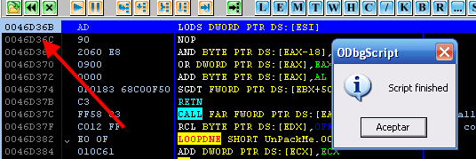

# Глава 53 - Победитель задания из главы 52

Хорошо, победитель обоих частей конкурса из прошлой части - это Ularteck, который прислал оба скрипта [\[ссылка\]](.gitbook/assets/files/53/scripts%20(53).7z) и объяснение первой части в виде туториала, который мы используем здесь. Вот скрипт-победитель первой части, который предназначается для починки украденных байтов. Объяснение идёт ниже.

```assembly
\*
###################################################################

CracksLatinoS - 2006 Скрипт создан: Ulaterck.

Описание: Скрипт создан для курса "Введение в крэкинг с нуля, используя OllyDbg" Рикардо Нарвахи, главы 52-ой. Он предназначается для первой части: ищет OEP и чинит украденные байты.

Цель: UnPackMe_TPPpack.exe ***\[******[ссылка](.gitbook/assets/files/52/TPPpack.7z)******\]***Требования: ODBGScript 1.48 ***\[******[ссылка](.gitbook/assets/files/52/ODbgScript.1.48.VC6.7z)******\]***, HideDebugger 1.24 ***\[******[ссылка](.gitbook/assets/files/19/HideDebugger124.7z)******\]***, HideOD ***\[******[ссылка](.gitbook/assets/files/22/hideod.7z)******\]***, остановленные на точке входа, снять все случаи исключений меньше KERNEL32, так как используемый метод – это метод исключений Рикардо. - Перед запуском скрпита отметьте последнее найденное исключение, так как скрипт этого ожидает.

В любом случае смотрите объяснение, которое находится ниже.
####################################################################
*/

var dir_excep
var Newoep
var dir_JMP

var dir_CALL
var oep
var StartScan
var Opcodes
var temp
var temp2
var temp3 Datos:
mov Newoep, eip // Сохраняем адрес точки входа
// Отмечаем последний адрес скрипта
ask "Введите последнее исключение" // Выводить окно для ввода данных.
cmp $RESULT,0 // Сравниваем, был ли введён какой-либо адрес.
je aviso // Если нет, то прыгаем на метку aviso
mov dir_excep, $RESULT // Если ввели адрес сохраняем его в dir_excep.
jmp Inicio // Прыгаем на метку Inicio, чтобы продолжить.

aviso:
msg "Выполняем скрипт заново – введите правильный адрес"
jmp final Inicio:
run // Запускаем программу
eoe verifica // Если происходит исключение, переходим на метку verifica.

verifica:
cmp eip,dir_excep // как только мы здесь из-за исключения, смотрим, последнее ли оно.
je ultima // Если да, то переходим на метку ultima.
esto // Если нет, то запускаем SHIFT + F9, чтобы пройти исключение.
jmp Inicio: // И переходи на метку Inicio для поиска других исключений

ultima:
findop eip,#FFE0# // Попав на последнее исключение, ищем переход JMP EAX на украденный код.
mov dir_JMP,$RESULT // Как нашли – сохраняем адрес в dir_JMP
bp dir_JMP // Устанавливаем точку останов (F2) на переход JMP EAX.
esto // Проходим исключениес помощью SHIFT + F9, чтобы оказаться в точке останова
bc dir_JMP // Снимаем точку останова с перехода JMP EAX.
sti // Запускаем F7, чтобы оказаться в украденном коде.

mov oep,eip // Сохраняем адрес украденного OEP.
mov StartScan,eip // Сохраняем адрес OEP также в StartScan, который используется для поиска Call'ов.

BuscarCall: // Также начинаем искать прямые вызовы, чтобы починить их, когда будет создаваться двоичная копия, и прикрепить их к новому OEP.
// Посмотрите MIniTuto.PARTE1.doc
findop StartScan,#E8# // Ищем прямые вызовы, которые начинаются с опкода E8
cmp $RESULT, 0 // Когда их больше нет, $RESULT равен 0 и переходим на метку final.
je final
mov dir_CALL, $RESULT // Сохраняем адрес первого встреченного call (вызова).
mov StartScan, $RESULT // Задаём, откуда ходим искать вызовы, в данном случае – оттуда, где был встречен первый вызов.
add dir_CALL,1 // К адресу встреченного вызова прибавляем 1, чтобы миновать опкод E8.
mov Opcodes, [dir_CALL] // Перемещаем опкоды из этого адреса в Opcodes.
add Opcodes,StartScan // К этим опкодам прибавляем адрес вызова.
add Opcodes,5 // К результату прибавляем 5 и получаем адрес, который указывает на вызов.
// Для пояснений смотрите MiniTuto.PARTE1.doc.


// Теперь назначаем встреченному вызову новый опкод, чтобы при создании двоичного
// файла и вставке нового OEP этот вызов был починен.

mov temp, StartScan // Помещаем адрес, содержащий StartScan, во временную переменную. ( StartScan = адрес встреченного вызова.)
sub temp, oep // От адреса вызова на починку отнимаем адрес OEP украденного кода.
mov temp2, Newoep // Перемещаем адрес нового OEP (EntryPoint) в вторую временную переменную.
add temp,temp2 // К ней прибавляем значение первой.
sub Opcodes, temp // Теперь отнимаем результат от адреса, на который указывает CALL.
sub Opcodes, 5 // И от того, что остаётся, отнимаем (в оригинале – прибавляем, но это не соответствует команде) 5, получая необходимые для починки этого вызова опкоды.

Editar: // Начинаем редактировать вызов с помощью новых опкодов.
mov temp3, StartScan // Помещаем в третью временную переменную адрес вызова для починки, содержащийся в StartScan.
add temp3,1 // К адресу вызова прибавляем 1, чтобы не учитывать опкод E8.
mov [temp3], Opcodes // Чиним вызов новыми опкодами.
jmp BuscarCall

final:
ret
```

Теперь продолжаем объяснение, как всё это работает, написанное Ularteck'ом.

## Часть 1: Ищем OEP и чиним украденные байты (написано Ularteck'ом)

### Введение:

Хотя всё уже было объяснено в туториале №4 курса C97, написанного marciano, поясню некоторые вещи, чтобы пояснить как выполняется скрипт.

Marciano говорил об ошибке из-за антиотладочного OpenProcess'а, хотя у меня она не возникала.

Вот конфигурация используемых плагинов.


И с помощью этого крэкми у меня запустилось превосходно.


Метод, использованный для нахождения OEP для этой программы, мне понравился, так как часть встречается в новых версиях Asprotect, таких как 2.1 SKE , 2.2 SKE и 2.3 SKE, в которых есть украденный код.

Конфигурируем исключения.


Запускаем программу, и как только она начинается выполняться, идём в Log, чтобы посмотреть, каким было последнее исключение.


В моём случае это 0046D36B, что и будем использовать для скрипта, однако сейчас выполним ручную процедуру по поиску OEP.

Перезапускаем.

Нажимаем ALT+O.


И конфигурируем согласно картинке выше.

Запускаем программу с помощью F9 и проходим исключения с помощью SHIFT + F9, пока не окажемся в исключении по адресу 0046D36B, то есть в последнем


Теперь, находясь на последнем исключении, нажимаем ALT + M.

И устанавливаем точку останова на доступ к памяти в секции кода.


И нажимаем SHIFT + F9, чтобы пройти исключение и оказаться здесь.


Но это не OEP. Если посмотрим на стек.


Видим, что это исполняемый код. Выполненный код находится по адресу 8B0EA4 в секции 8B0000.


Так что перезапускаем. Делаем ту же процедуру, но точку останова устанавливаем теперь на доступ к этой секции. Начинаем делать скрипт для автоматизации задач.


После этого перезапускаем Olly и запускаем скрипт.


Нам показывается диалоговое окно, в котором нужно указать последнее исключение. В моём случае это 46d36b.

Нажимаем OK.



И когда оказываемся в этом исключении – выполнение останавливается.

Нажимаем ALT + M.


И вместо установки BP на доступ к секции кода, делаем это на секцию где бы выполненный код. Нажимаем SHIFT + F9 и оказываемся в украденном коде.


Если нажмём клавишу "-", то увидим, что находимся в последнем исключении.

И ниже находится переход, о котором нам говорил marciano, что он тот, который ожидаемо переносит нас на OEP, и как только мы его нашли, сразу модифицируем скрипт, чтобы когда, в последнем исключении, найдётся этот переход, на него, среди опкодов FFEO, была установлена точка останова, и когда находимся на переходе, мы нажимаем F7, чтобы перейти на украденный код.

В секции переменных скрипта добавляем ещё одну:


dir\_JMP, в которой будет храниться адрес перехода JMP EAX.

И в метке ultima добавляем следующее:


Пробуем.


И готово — мы в OEP. Здесь дело усложняется, как сказал marciano, если скопируем этот код в точку входа:


Просто скопируем кусок украденного кода, как минимум прямой вызов, который находится в 008B0E9F.

И вставляем в точку входа:


Здесь у нас немного вставленного когда, видимо, что это косвенный вызов, который находится по адресу 0046b067. Он испорчен, посмотрим, куда он должен указывать. Идём туда, где находится OEP.


В оригинальном украденном коде находится CALL 004293A0.

Значит этот вызов нам нужно починить, чтобы, когда скопируем его в другую часть, он указывал в то же место. Как это сделать?

Идём по этому вызову в DUMP.


Не берём в расчёт E8 и используем четыре следующих байта.

FF B7 84 FC -> назовём их "OPCODES".


Берём адрес из Call 008B0E9F -> назовём его DIR\_CALL.

Теперь этот вызов становится CALL 004293A0, а адрес получили следующим образом:

УКАЗАТЕЛЬ = OPCODES + DIR\_CALL + 5

УКАЗАТЕЛЬ = FFB784FC + 008B0E9F + 5 = 004293A0

Хорошо, теперь у нас есть адрес, куда должен указывать вызов, чиним его с помощью новых опкодов и эти новые опкоды мы рассчитываем (*не уверен, что правильно понял его здесь — прим. пер.*) таким образом.

УКАЗАТЕЛЬ – НОВЫЙ\_УКАЗАТЕЛЬ – 5 = НОВЫЕ ОПКОДЫ

НОВЫЙ\_УКАЗАТЕЛЬ: рассчитываем таким образом.

Например:


Если скопируем первые строки украденного кода и скопируем их в точку входа.


Видим, что первый прямой вызов будет находится по этому адресу в точке входа 0046B057. Поэтому этот адрес рассчитываем так:

ИСХОДНЫЙ АДРЕС – АДРЕС OEP (УКРАДЕННЫЙ КОД) + АДРЕС ТОЧКИ ВХОДА, где ИСХОДНЫЙ АДРЕС = 008B09EF


АДРЕС OEP (УКРАДЕННЫЙ КОД) = 008B0E48


И АДРЕС ТОЧКИ ВХОДА : 0046b010


8B0E9F - 8B0E48 + 46B010= 0046B067 , по этому адресу будет находится наш починенный адрес.

Получается, что НОВЫЙ АДРЕС = 0046B067

Теперь у нас есть данные, чтобы рассчитать НОВЫЕ ОПКОДЫ.

004293A0 - 0046B067 – 5 = FFFBE334

У нас есть новые опкоды. Теперь осталось их отредактировать вручную. Идём в первый прямой вызов в украденном коде.


В дампе нам показывают вот что:


Не берём E8 и модифицируем следующие за ним четыре байта:


И заменяем их новыми опкодами.


Видим, что наш вызов стал ужасен, но если скопируем этот кусок кода и вставим в точку входа.


Остаётся починенный код, как раз такой, какой должен быть.

Теперь нужно сделать это для других прямых вызовов, но мы оставляем это скрипту, к которому добавляем следующее:


А потом ещё вот это:


Запускаем скрипт.


Видим, что починились все нужные вызовы.

Выбираем весь украденный код: делаем Binary Copy.

И вставляем в точку входа.


Находясь в точке входа, меняем EIP.


Говорим, что "Да" и делаем дамп.


Marciano говорил, что нужно поменять это


На


Ставим флажок "Rebuild Import" и нажимаем "Dump".


Вот наш сдампленный файл, в котором проблема с IAT.

Если попробуем открыть его с помощью Олли:


Попробуем починить его с помощью PE Editor'а [\[ссылка\]](.gitbook/assets/files/34/PETools.7z).


И готово.


В плагине HideOD есть ошибки, которые приводят к тому, что некоторые программы не запускаются, поэтому лучше заменить его на HideDebugger и OllyAdvanced [\[ссылка\]](.gitbook/assets/files/50/OllyAdvanced-1.26-beta10.7z).

Ок, на этом можно завершить объяснение скрипта из первой части и перейти к скрипту из второй.

```assembly
var base
var dir_VirtualAlloc
var dir_VirtualProtect
var dir_mov

Inicio:
gpa "VirtualAlloc", "kernel32.dll" // Ищем адрес функции VirtualAlloc
mov dir_VirtualAlloc, $RESULT
log dir_VirtualAlloc

gpa "VirtualProtect", "kernel32.dll"
mov dir_VirtualProtect, $RESULT

bp dir_VirtualAlloc
run
eob info

info:
mov base, eax
log base
bc dir_VirtualAlloc
bp dir_VirtualProtect

Zona:
eob seccion
run

seccion:
cmp esi, 00460000
je retornar
jmp Zona

retornar:
bc dir_VirtualProtect
mov Reg_esp, [esp]
bp Reg_esp

eob zona_1
run

zona_1:
bc Reg_esp
find base, #897C24188B4424#
mov dir_mov, $RESULT
log dir_mov
jmp nopear

nopear:
bp dir_mov
eob nopear2
run
nopear2:
bc dir_mov
fill dir_mov, 4, 90

final:
msg "MOV занопан. Нажмите RUN (F9)."

ret
```

Метод для починки IAT – классический, который был хорошо объяснён в туториале marciano. Устанавливаем BPM ON WRITE на одном из плохих элементов IAT, который нашли ранее, находясь в OEP, а затем пытаемся попасть в место, где сохраняется плохое значение. К сожалению во время выполнения функции VirtualProtect стирает BPM ON WRITE, так что нужно установить BP на этой функции, чтобы произвести восстановление вышеуказанного BPM, когда она отработает.


Здесь видим изображение, взятое из туториала marciano, когда происходит останов на VirtualProtect, чтобы изменить права доступа к области IAT, так что в этот момент должны дойти до RET и снова установить BPM ON WRITE, чтобы продолжить с помощью "RUN", пока не остановимся на месте, где плохое значение сохраняется в элементе.


Останавливаемся здесь, где происходит сохранение. Плохое значение находится в EAX, а EBP указывает на элемент IAT, за которым мы наблюдали.

Затем устанавливаем BP несколькими строками выше, и когда останавливаемся, то трассируя видим следующее:


Заменяем правильный адрес функции на плохое значение, которое сохраняется несколькими строками ниже, так что работа сводится к тому, чтобы заNOPить эту строку, так как правильный адрес будет сохраняться чуть позже.

Так что скрипт толже установить местонахождение этой инструкции и заNOPить её.

Таким образом, первое что делает скрипт — это ищет адрес API-функции VirtualAlloc, так как первый раз, когда останавливается на ней, получает адрес области, где находится инструкцию, которую нужно заNOPить. Этот адрес может быть разным на разных машинах, поэтому его необходимо искать.

```assembly
var base
var dir_VirtualAlloc
var dir_VirtualProtect
var dir_mov

Inicio:
gpa "VirtualAlloc", "kernel32.dll" // Ищем адрес функции VirtualAlloc
mov dir_VirtualAlloc, $RESULT
log dir_VirtualAlloc
```

Здесь сохраняем адрес вышеуказанной функции в переменную var dir_VirtualAlloc, потом делаем то же самое с функцией VirtualProtect.

```assembly
gpa "VirtualProtect", "kernel32.dll"
mov dir_VirtualProtect, $RESULT
```

В переменной var dir_VirtualProtect сохраняем адрес соответствующей API-функции.

```assembly
bp dir_VirtualAlloc
run
eob info

info:
mov base, eax
log base
bc dir_VirtualAlloc
bp dir_VirtualProtect
```

Затем нужно установить BP на VirtuallAlloc, делаем RUN и с помощью eob останавливаемся на указанном bp, сохраняем в переменной base адрес, где программа собирается создать область, в которой будет находится адрес для NOPинга.

Также устанавливаем BP на API-функции VirtualProtect.

```assembly
Zona:
eob seccion
run

seccion:
cmp esi, 00460000
je retornar
jmp Zona
```

Когда останавливаемся на BP, сравниваем равен ли ESI 460000, что является началом IAT, так как VirtualProtect использует его как аргумент функции для защиты указанной зоны и стирает BPMы, которые там находится, и если равна, то идём в метку retornar.

```assembly
retornar:
bc dir_VirtualProtect
mov Reg_esp, [esp]
bp Reg_esp
```

Где стирается BP на функции VirtualProtect, ищется значение, что будет находится в \[esp\] и устанавливается BP, чтобы остановиться, как только выйдем из API-функции.

```assembly
zona_1:
bc Reg_esp
find base, #897C24188B4424#
mov dir_mov, $RESULT
log dir_mov
jmp nopear
```

Когда возвращаемся из API-функции, то уже можно искать инструкцию, которую будем NOPить. Искать надо по достаточно большой последовательности байтов, чтобы не встретить левые инструкции: 897C24188B4424.


После того, как нашли, делаем переход на процедуру заNOPления.

```assembly
nopear:
bp dir_mov
eob nopear2
run
nopear2:
bc dir_mov
fill dir_mov, 4, 90

final:
msg "MOV занопан. Нажмите RUN (F9)."

ret
```

Вот и всё объяснение и спасибо Ularteck'у за хорошую работу и marciano за его прекрасный туториал, из которого мы взяли изображения для объяснения 2-ой части скрипта.

Думаю, что это поможет вам освоить технику создания скриптов, думаю, что она очень мощная и в ней нет ничего трудного, есть приложить немного упорства.

В 54-ой части мы начнём новую тему.

\[C\] Рикардо Нарваха, пер. Aquila
