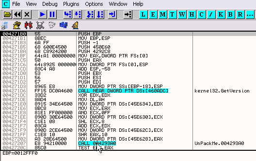

# Глава 54 - Распаковка ExeCryptor v2.2.50.a. Часть 1

При анализе неизвестного упаковщика лучше всего сначала проверить, существует ли для него известный анпэкми, поскольку нам нужен его распакованный код. Если, как в нашем случае, анпэкми есть, у нас будет и код распакованного анпэкми для сравнения.

Анпэкми могут быть реализованы в нескольких вариантах, начиная от самой простой защиты упаковщика, до самой сложной, чтобы можно было постепенно обезвреживать каждый трюк. Когда нам будут известны все трюки упаковщика, можно будет приступать собственно к программе; так происходит постепенное изучение. Со временем появляются новые версии упаковщика, но нужно достаточно хорошо разбираться в функционировании предыдущих, поскольку изменения обычно незначительны.

Здесь будет рассмотрена серия анпэкми ExeCryptor’а, которая отражает хоть и не самую последнюю версию, но всё же почти последнюю, и это позволит нам постепенно его изучить, если мы будем пытаться узнать как можно больше. Это гнусный упаковщик, и для его изучения потребуется приложить немало сил.

У нас есть несколько уровней анпэкми, в которых постепенно повышается трудность и добавляются трюки:


На скриншоте указан самый простой уровень. После запуска анпэкми объявляет, какую защиту он содержит:


Здесь почти ничего нет, хе-хе, но для начала этого вполне достаточно. Кроме того, у меня есть распакованный анпэкми UPX ***\[[ссылка](files/54/UnPackMe_UPX1.91.a.7z)\]***, основанный на том же коде (я добавил его к туториалу). Этот распакованный крэкми можно будет использовать для сравнения, так как здесь IAT видна из OEP и всё просто. Данный крэкми сам по себе не столь важен, тем не ме- нее он может существенно ускорить дальнейшее изучение.

Вот EP распакованного UPX’а:



Как видим, это типичный анпэкми Тедди Роджерса, подобный тем, что уже рассматривались во "Введении". И данный анпэкми ExeCryptor’а основан на том же коде, а затем упакован. У него будет та же OEP = 4271B0, та же IAT; первая вызываемая им API-функция — GetVersion и т.д. Данное обстоятельство при изучении таких сложных упаковщиков (протекторов) оказывается большой помощью.

Хорошо, теперь приступим к изучению самого легкого ExeCryptor’а ***\[[ссылка](files/54/UnPackMe_ExeCryptor2.2.50.a.7z)\]***, то есть A.

Я подключил плагин Olly Advanced 1.26 Beta 12 ***\[[ссылка](files/54/OllyAdvanced-1.26-beta12.7z)\]***:


и воспользовался Parcheado 4 ***\[[ссылка](files/40/Parcheado%204.7z)\]*** (я всегда пользуюсь этой версией отладчика). В Olly Advanced отмечено много опций, но большинство из них не столь важны, кроме указанной на скриншоте Break on TSL Callback.

Думаю, все уже знают, что ExeCryptor перед переходом на EP выполняет код посредством трюка, объясненного уже очень много раз, и останавливается в TSL Callback перед EP. Предыстория такова, что один вирусописатель обнаружил, что система позволяет выполнять код перед EP, если была активизирована упомянутая опция, а автор ExeCryptor’а воспользовался этой идеей, поэтому обычно ExeCryptor при отладке в Olly закрывается перед переходом на EP, ибо он это обнаруживает.


Изменим настройки Olly так, чтобы он останавливался на System breakpoint.

Находясь на системном брейке, нажмем RUN, и следующая остановка произойдет в TLS Callback:


В строке статуса Olly сообщает:


Чтобы найти этот адрес вручную, обратимся к заголовку по Go to –> Expression = 400000 и установим режим Special –> PE header. Прокрутив вниз, увидим:


Начало таблицы TLS равно 93110, а с ImageBase будет 493110. Посмотрим в Dump’е чуть ниже начала этой таблицы:


Здесь находим адрес, откуда начинает выполняться ExeCryptor, но плагин Olly Advanced уже сделал эту работу за нас и остановился в нужном месте.

Кроме того, если откроем файл в [PEditor’е](files/45/PEditor1.7.7z):


В directory видно, что Tls Table начинается в 493110 и размер у нее 18. Но будет точнее, если нажмем кнопку TLS *\[в PE Editor’е LordPE или PE Tools это будет кнопка "..." в соответствующей строке. — Р. С.\]*, и станет ясно, где именно в таблице искать нужный адрес:


То есть адрес, откуда начинается выполнение, нужно смотреть в 49312C. В Дампе Olly видим:


Хорошо, теперь мы знаем, как найти этот адрес в Olly и в PE Editor’е. Если у нас есть Olly Advanced, то он поможет остановиться на TLS Callback, и искать это место вручную не придется. А если нет — то, находясь на System breakpoint, следует установить на найденный адрес BP, и будет тот же результат.

Есть одна проблема. Мы остановились в месте, где начинается выполнение.


Нажмем RUN:


Программа что-то обнаруживает и закрывается. Я активизировал все опции Olly Advanced, а также попытался запустить анпэкми в другой версии отладчика, пропатченной AntiDetectOlly\_v2.2.4.exe ***\[[ссылка](files/54/AntiDetectOlly_v2.2.4.7z)\]***, и произошло то же самое. Давайте исследовать. Вернемся сюда:


Если открыть окно Breakpoints, то там окажется один брейк, хотя мы и не устанавливали ни одного:


Ах! Ведь этот BP ставит OllyDbg для остановки на EP программы. Но ExeCryptor выполняется раньше, и так как это байт CC, записанный в указанную на скриншоте ячейку памяти, протектор может обнаружить его. Удалим его и посмотрим, что изменится. Нажимаем RUN:


Действительно, устанавливаемый Olly BP обнаруживается: если он присутствует, программа завершается, а если его вручную удалить, то работает. Если же анпэкми не запускается и после удаления брейка, стоит поставить больше галок в закладках Anti-Debug плагина Olly Advanced. Напоминаю, что мы используем версию OllyDbg под названием Parcheado 4; до сих пор ничего другого не потребовалось.

Теперь, зная решение проблемы, перезагрузим анпэкми:


Установим Break-on-execute на секцию кода, то есть на ту, которая начинается в 401000, поскольку предполагается, что распаковка происходит туда:


Вновь удалим BP, так как он автоматически устанавливается после каждой перезагрузки:


Теперь нажмем RUN:


Остановка произошла в знакомой OEP, то есть на 4271B0. У уровня защиты A нет ни украденных байтов, ни сокрытия OEP — ничего. Поэтому мы находимся на OEP и остаемся без работы. *\[Следует помнить, что для нормальной работы плагина OllyBonE галка с исключения Single-step break должна быть снята. — Р. С.\]*


Этот CALL, вызывающий GetVersion, в распакованном UPX’е указывает прямо на API-функцию, так как он не был перенаправлен. Здесь же он перенаправлен, поэтому придется фиксить IAT.

Посмотрим начало и конец IAT:


Она начинается в 460818, и ее можно сравнить с IAT распакованного UPX’а, чтобы посмотреть, какие есть различия и применены ли какие-либо трюки.

Если спустимся, увидим окончание таблицы:


Последний адрес — 460F28, он следует сразу после последнего элемента. Таким образом, Конец минус Начало дает Размер:


Это 710h, так что всё вместе:

```assembly
OEP: 271B0
RVA (Начало IAT): 60818
Size: 710
```

Данные для Import Reconstructor’а у нас есть.

Теперь нам нужно выяснить способ восстановления IAT’а. В данном случае "ключевого перехода" нет, но далее мы увидим, что ExeCryptor восстанавливает адрес и сохраняет его в элементе IAT’а при выполнении каждой API-функции.

Установим BPM ON WRITE на элемент IAT’а, соответствующий GetVersion, но прежде удалим Break-on-execute, иначе программа выдаст ошибку:


Находим элемент, соответствующий первой вызываемой API-функции:


Устанавливаем MEMORY BREAKPOINT ON WRITE и смотрим, где произойдет остановка:


Здесь сохраняется правильный адрес API-функции в соответствующем элементе.


Несколькими строками ниже происходит прыжок на верный адрес. Таким образом, каждый раз, когда используется какая-либо API-функция, соответствующий элемент IAT’а восстанавливается. Для восстановления всей таблицы было бы логично остановить выполнение в момент перед закрытием программы, но мы пока продолжим изучение.


Здесь видно, что после сохранения адреса API-функции идет запись байта C3 по адресу 479030, предварительно загруженному в EAX командой LEA. Посмотрим, что здесь происходит.

Листинг в 479030 изначально такой:


А после записи C3 становится таким:


То есть установлена команда RET, код автомодифицирован. Кроме восстановления API-функции происходит модификация части кода, находящегося не в первой секции, то есть принадлежащего ExeCryptor’у. Хмм, мы увидели, что происходит с этим адресом. Теперь перезагрузим анпэкми, дойдем до OEP и установим BPM ON ACCESS на инструкцию в 479030:


Доходим до первого вызова API-функции:


Ставим BP на ВОЗВРАТ, т.е. на 4271DC:


И нажимаем RUN:


Остановились на оригинальном переходе, т.е. это часть процедуры, которая узнает API-функцию. И только после этого записывается RET. Иными словами, здесь происходит автоизменение процедуры, распознающей API-функции.

Мы можем проверить, будут ли еще изменения: после перезагрузки дойдем до OEP и установим BPM ON WRITE на секцию ExeCryptor’а, в которую перенаправлены API-функции и упомянутая процедура. Доходим до OEP:


Я снова нахожусь на первом вызове API-функции, и здесь видно, что переход будет выполнен на адрес переадресации 492493, принадлежащий той же самой секции, что и условный переход в 479030, подлежащий замене на RET. Таким образом, можно установить BPM ON WRITE на всю эту секцию и посмотреть, что происходит в программе…


Ставим BP на возврате, нажимаем RUN и наблюдаем изменения, которые произойдут в секции и в процедуре, распознающей API-функции, во время этого первого вызова:


Продолжаем:


Далее:


Так меняется последовательность байтов. Я не стал показывать их все, чтобы не перегружать туториал. Посмотрим в DUMP’е изменяемое место:


Хорошо, сохранилось имя DLL’ки, в которой будет происходить поиск API-функции.

Продолжим:


Теперь там же сохраняется ноль, чтобы обозначить конец имени.


Процесс повторяется, но теперь поверх "K" сохраняется байт B4, и так со всем именем — оно скрывается.


Здесь сохраняется адрес базы kernel32.dll, равный на моем компьютере 7C800000.


И после того, как в IAT’е сохранен верный адрес, записывается байт C3. Теперь ситуация проясняется: RET нужен, чтобы не выполнять два раза одну и ту же процедуру. Данный путь для рассмотренного элемента закрывается — он пройден и больше не потребуется, поскольку соответствующий адрес восстановлен.


До остановки на BP изменений больше не произошло. Удалим брейк и с помощью F7 дойдем до этой API-функци:


Поставим BP на возврате и нажмем RUN:


Остановка произошла при записи другого RET’а уже в 47A0BC.


Далее доходим до BP. На скриншоте видно, что восстановленный элемент IAT’а соответствует kernel32.dll, как и первый. Ух…

Дойдем до вызова третьей API-функции:


Попав сюда, посмотрим в распакованном UPX’е то же место:


Это CALL в VirtualAlloc. Установим BP на возврат и нажмем RUN:


Здесь сохраняется еще один RET. Посмотрим участок соответствующего кода перед его изменением:


Этот RET записывается чуть ниже JMP’а на восстановленный адрес API-функции.


То есть происходит то же самое, что и с предыдущей API-функцией — закрывается вход в процедуру. Сперва она выполняется, а уже после восстановления элемента IAT’а происходит запись RET, чтобы она не выполнялась повторно. Это подобно закрытию внутреннего входа в элемент.

Сделанный нами вывод можно проверить ручной трассировкой.


Это происходит дважды: первый раз программа доходит до POP EDX и процедура выполняется. А после восстановления элемента IAT’а записывается RET и вход закрывается:


То есть, когда API-функция восстановлена, вся эта область автоматически аннулируется, поскольку программе достаточно прямого адреса API-функции в IAT’е. И даже если есть другой путь, программа им не пойдет, ибо обнаружит RET на входе, и всё закончится JMP’ом на API-функцию.

Таким образом, сначала находится имя DLL’ки, которое используется для получения основания (скорее всего с помощью LoadLibraryA). Затем производится поиск адреса API-функции и его сохранение в IAT’е. И, в конце концов, в секцию вносятся изменения, чтобы закрыть вход в отработанную процедуру.

Можно попытаться задействовать скрипт: дойти до ExitProcess, а далее с помощью скрипта восстановить CALL’ы API-функций. Данное задание довольно трудно из-за того, что код меняется, однако это может оказаться хорошим стимулом для выхода следующей части "Введения". Как бы то ни было, но проблему с IAT нужно решать, поскольку она есть во всех уровнях ExeCryptor’а, которые мы рассмотрим. IAT всех уровней одинакова, и если мы сейчас восстановим ее, то проблема будет полностью преодолена (только эта — другие же только начнутся, хе-хе).

До следующей главы, где будет рассмотрен скрипт для восстановления IAT ExeCryptor’а.

\[C\] Рикардо Нарваха, 03.10.06 пер. Рома Стремилов, 11.2010
