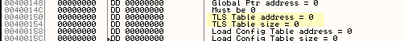

# Введение в крэкинг с нуля, используя OllyDbg - Глава 55

[Прикрепленные файлы к статье](files/55/(123)AttachedFiles.zip)

В этой главе мы продолжим починку execryptor, для этого мы создадим скрипт, ремонтирующий IAT. У многих, когда они слышат слово "скрипт", волосы встают дыбом (если они есть, хе-хе-хе), но создать скрипт - действительно очень просто, загвоздка состоит в том, что, когда смотришь на готовый скрипт, кажется, что он очень сложен, но в действительности скрипт не формируется сразу цельным, он начинается с простой идеи, к которой затем добавляются части, например, для execryptor, в котором мы должны починить таблицу, после того, как мы остановимся на OEP, нужно сначала придумать характерную идею, из которой сделать скрипт и сделать блок-схему. Я буду показывать процесс создания скрипта, вместо того, чтобы сразу дать готовый, для того, чтобы вы увидели, как он формируется.

Идея заключается в том, чтобы скрипт пробегал таблицу и чинил переадресовочные функции, что звучит довольно просто, поэтому давайте перейдем к написанию

базового варианта скрипта.

Должна быть переменная для перемещения по таблице, которая бы хранила адрес функции, чтобы быть оригинальными, назовем ее "таблица", хе-хе.

`var tabla`

затем я должен присвоить ей начальный адрес, являющийся началом таблицы

`mov tabla,460818`

теперь, когда мы проинициализировали переменную, мы сделаем loop, который будем пробегать весь IAT, он будет проверять адрес на перенаправление и, если это так, чинить его, если нет - перемещаться к следующему

```assembly
start:
cmp [tabla],50000000
ja saltear
log tabla
end

saltear:
add tabla,4
jmp start
```

это базовый вариант, здесь он проверяет, не превосходит ли адрес 50000000, так как начиная с этого адреса памяти в этом случае размещаются dll, а значит, если значение адреса больше, это прямой вызов api, в случае чего происходит увеличение значения переменной "таблица" для перемещения ко второму адресу.

Здесь все просто, можно видеть, что в случае, если это переадресация, не совершается прыжок и скрипт идет сюда

```assembly
log tabla

end
```

здесь должно быть то, что будет чинить адрес функции, но перед этим я хочу убедиться в том, что он найдет адрес первой функции и завершит работу, не выполняя loop, так как по опыту знаю, что неплохо перед усложнением проверить работоспособность написанного.


Так как мы находимся в OEP, давайте запустим скрипт и посмотрим на результат.


Постоянно случается какая-то глупость, хе-хе, команда для завершения работы не end, а ret, давайте исправим.

```assembly
var tabla
mov tabla,460818
start:
cmp \[tabla\],50000000
ja saltear
log tabla

ret
saltear:
add tabla,4
jmp start
```

Мы исправили глупость, которую мы сделали и попытались снова.


Хорошо, по крайней мере нам не выдалась ошибка, в log мы видим первый адрес.


Давайте посмотрим, соответствует ли значение диапазону переадресации, для этого можно добавить другую переменную, хранящую содержимое адреса, я назову ее "содержимое", хе-хе

```assembly
var tabla
var contenido
mov tabla,460818
start:
cmp [tabla],50000000
ja saltear
log tabla
mov contenido,[tabla]
log contenido
ret

saltear:
add tabla,4
jmp start
```

Таким образом, мы добавили переменную "содержимое", и, как ясно из названия, она хранит содержимое адреса, на который указывает "таблица", так что сейчас, в логе должны быть адрес ячейки IAT и его содержимое.


В окне log, я вижу адрес элемента IAT, который нужно починить и его содержимое, которое равно 47FCA8, что говорит нам о том, что скрипт выполнился правильно, следующий шаг состоит в том, чтобы убрать RET и посмотреть на процесс выполнения скрипта, что ODBGScript позволяет сделать с помощью процедуры трассировки, поэтому давайте пойдем в...


Мы открыли окно трассировщика скрипта


Мы видим наличие команды трассировки с горячей клавишей "S" а также возможность размещения BP на некоторой строке с помощью "F2", что нам вполне достаточно для трассировки скрипта и поиска возможной ошибки, давайте пройдем по скрипту с помощью "S".


Мы видим, что в колонке нам показывается значение EIP и в Values, если есть какая-то операция, нам показывается ее содержимое, в этом случае содержимое, равное 47fcab, также мы могли бы поставить BPS и дойти до этой строки с помощью его, но так как у нас все в порядке, мы закроем окно и продолжим работу над скриптом.

Сейчас давайте добавим условие, учитывающее ситуацию, когда скрипт подойдет к концу таблицы и будет необходимо закончить его работу.

```assembly
var tabla
var contenido
mov tabla,460818
start:
cmp tabla,460f28
ja final
cmp \[tabla\],50000000
ja saltear
log tabla
mov contenido,\[tabla\]
log contenido
ret

saltear:
add tabla,4
jmp start
final:
ret
```

Здесь я добавил проверку на адрес конца таблицы и, как только адрес станет больше либо равным адресу конца таблицы, произойдет перемещение в конец скрипта и он завершит свое выполнение.

Теперь мы можем убрать ret и убедиться в том, что все адреса и их содержимое в log'е относятся к переадресовочным элементам.

```assembly
var tabla
var contenido
mov tabla,460818

start:
cmp tabla,460f28
ja final
cmp \[tabla\],50000000
ja saltear
log tabla
mov contenido,\[tabla\]
log contenido

saltear:
add tabla,4
jmp start
final:
ret
```

Здесь мы видим, что мы убрали ret, который был под LOG, таким образом, код продолжит свое выполнение, увеличит адрес таблицы на 4 и будет повторять этот процесс до тех пор, пока не будет пройдена вся IAT, давайте посмотрим так ли это.


В логе содержатся все данные


Но есть одна проблема - мы видим, что содержимое некоторых адресов равно нулю - а мы знаем что это просто разделитель - поэтому нам нужно добавить проверку и против этой ситуации

```assembly
var tabla
var contenido
mov tabla, 460818

start:
cmp tabla, 460f28
ja final
cmp [tabla], 50000000
ja saltear
mov contenido, [tabla]
cmp contenido, 0
je saltear
log contenido
log tabla
saltear:
add tabla, 4
jmp start
final:
ret
```

Мы видим, что добавляем в скрипт понемногу, так как никто не делает скрипты такими, какими мы видим их в туториалах, напротив, мы начинаем с основы и добавляем отдельные участки, как сейчас с проверкой на ноль.


Мы видим, что сейчас у нас в логе все адреса, которые нужно починить и теперь можно приступить к написанию части, которая будет заниматься непосредственно ремонтом (или попытаться это сделать, хе-хе)

Хорошо, сейчас давайте подумаем, будет ли это работать, если в этой точке я изменю EIP и помещу ему значение содержимого, думаю что да, но необходимо предусмотреть способ остановки до выполнения самого api, так как мы не размещаем правильные параметры и выполнение привело бы к ошибке

Мы знаем, что перед тем, как выполнить api, происходит сохранение адреса функции, мы можем поместить BPM ON WRITE на него, таким образом управление выполнением снова вернется скрипту и не позволит выполнить api и скрипт перейдет к следующему адресу.

## BPWM

`BPWM addr, size`

> Set memory breakpoint on write. Size is size of memory in bytes.
>
> Example:
>
> `bpwm 401000, FF`

это инструкция, которая размещает BPM ON WRITE

```assembly
mov eip,contenido
bpwm tabla, 4
```

(прим. пер. у меня заработал только вариант с аппаратной точкой останова bphws tabla, "w")

Эти инструкции предназначены для починки адреса функции, здесь происходит перемещение значения переадресовочного элемента в eip и установка BPM ON WRITE на его адрес.

Далее мы используем инструкцию COB, которая убирает EOB и передает управление следующей инструкции, после срабатывания BP

```assembly
//Makes script continue execution after a breakpoint has occured (removes EOB)
//Example:
//COB

mov eip,contenido
bpwm tabla, 4
cob reparar
run

reparar:
ret
```

Таким образом, после размещения BPM ON WRITE, мы начинаем выполнение программы, и когда возникнет исключение или breakpoint, выполнение попадет на метку reparar, давайте проверим функционирование для первого адреса. (также мы могли бы использовать трассировщик и поместить bp там - то же самое )


Мы видим, что оно действительно функционирует, однако, остановка происходит перед выполнением операции записи и значит мы должны выполнить текущую строку кода с STI

```assembly
//Execute F7 in OllyDbg.
//Example:
//sti
//с помощью этого выполнится только одна инструкция, это эквивалентно нажатию на F7

mov eip,contenido
bpwm tabla, 4
cob reparar
run

reparar:
sti
ret
```

Если я выполню это снова, скрипт отремонтирует первый адрес и завершит работу.


Мы видим, что первый адрес отремонтирован и скрипт завершился, так что все в порядке, теперь нужно перейти к следующему без выполнения api для избегания ошибки.


Мы видим, что в процессе выполнения скрипта программа завершается, программа вызывает исключение, которое приводит к ошибке, так что в процессе починки мы должны иметь это ввиду, так как по некоторой причине происходит исключение, необходимо проверять находимся ли мы в нужном месте, здесь нам очень пригодится отладчик OdbgScript, давайте посмотрим

Ничего не меняя, посмотрим где ошибка.


Поместим BP на этой строке с F2, далее программа сохранит первый адрес, давайте посмотрим что произойдет далее.


Выбираем Resume и останавливаемся на sti


Хотя мне сообщается значение EIP, давайте перепроверим где мы находимся с помощью olly.


Далее должен быть сохранен адрес инструкции, так что давайте нажмем S, чтобы следующая инструкция выполнилась.


Пока все идет нормально, проблема появляется, когда будет происходить починка второго адреса, давайте продолжим отладку с помощью S, чтобы увидеть что происходит.


Мы видим, что "таблица" принимает корректное значение следующего адреса.


Мы видим, что происходит работа со вторым адресом и его значение корректно.


Сейчас он должен поместить BPM ON WRITE на второй адрес, если мы продолжим трассировку, то увидим, что RUN приводит к исключению, которое в конечном итоге приводит к завершению выполнения программы.

давайте посмотрим где у нас ошибка


Когда скрипт будет выполняться, я могу оставить его и продолжить выполнение с olly для того, чтобы найти ошибку, поэтому я выбираю ABORT, что приводит к завершению выполнения скрипта и продолжаю отладку в olly


Тут мы в начале переадресовочной функции для второго адреса, трассируем


Обмениваемся содержимым esp с eax, хммм


Помещаем в eax значение ноль, которое расположено по этому адресу памяти

Мы видим, что трассировка здесь довольна рутинна и подходит разве что для выполнения китайцами, поэтому давайте оставим это бесперспективное занятие.

Давайте перейдем на второй адрес в IAT и посмотрим откуда он вызывается.


Я меняю EIP с помощью new origin here на выражение CALL, помещаю BPM ON WRITE в IAT и BP на возврат из CALL и вижу, что выполнение функции не приводит к починке адреса, таким образом становится ясна причина неправильной работы скрипта, так как здесь не выполняется логика, которая работала для первого адреса, заключающаяся в том, что происходит поимка BPM ON WRITE после сохранения правильного адреса, однако для второго адреса это не работает и надо искать другой вариант, который бы подошел для обоих.

Хорошо, мы будем искать другое решение, оно не будет таким элегантным, но будет работать, давайте оттрассируем первый адрес, поместив на него BPM ON WRITE, так как мы знаем, что для него оно сработает, трассировка будет довольно длинная и займет около 5 минут.

>00483C91 Main MOV AL,1 ; EAX=77DA6C01
>
>00483C93 Main JMP 00483C78
>
>00483C78 Main MOV BYTE PTR SS:\[EBP-5\],AL
>
>00483C7B Main MOV AL,BYTE PTR SS:\[EBP-5\]
>
>00483C7E Main POP ECX ; ECX=01000001, ESP=0012FE6C
>
>00483C7F Main POP ECX ; ECX=77DA6C75, ESP=0012FE70
>
>00483C80 Main POP EBP ; ESP=0012FE74, EBP=0012FE80
>
>00483C81 Main RETN ; ESP=0012FE78
>
>004833D5 Main TEST AL,AL ; FL=0
>
>004833D7 Main JNZ 0047CC50
>
>0047CC50 Main POP ECX ; ECX=00000001, ESP=0012FE7C
>
>0047CC51 Main POP ECX ; ECX=77DA6C75, ESP=0012FE80
>
>0047CC52 Main POP EBP ; ESP=0012FE84, EBP=0012FFB0
>
>0047CC53 Main RETN ; ESP=0012FE88
>
>**0047691C Main MOV EAX,DWORD PTR SS:\[EBP-C\] ; EAX=77DA6BF0**
>
>0047691F Main MOV ESP,EBP ; ESP=0012FFB0
>
>00476921 Main JMP 004765DC
>
>004765DC Main JMP 0047F15C
>
>0047F15C Main PUSH 47C9B5 ; ESP=0012FFAC
>
>0047F161 Main JMP 00491A5F
>
>00491A5F Main JMP 004737D4
>
>004737D4 Main RETN ; ESP=0012FFB0
>
>0047C9B5 Main POP EBP ; ESP=0012FFB4, EBP=0012FFF0
>
>0047C9B6 Main RETN ; ESP=0012FFB8
>
>0046E81D Main RETN ; ESP=0012FFBC
>
>Memory breakpoint when writing to \[00460818\]

это последние строки, выполняющиеся перед memory breakpoint, так что мы попробуем найти место, через которое проходят все поступающие данные

`0047691C Main MOV EAX,DWORD PTR SS:[EBP-C] ; EAX=77DA6BF0`

здесь действительно происходит помещение результирующего адреса api в EAX, мы можем поместить один HE, чтобы посмотреть, будет ли это работать и со вторым адресом

Как и для первого адреса здесь происходит помещение в EAX верного значения api, трассируем


мы видим, что, если продолжить трассировку и сравнить ее с трассировкой первого адреса разница будет здесь

`0046E81D C3 RETN`

в первом адресе совершается прыжок на код, сохраняющий правильный api в IAT, в то время как для второго адреса прыжок перемещает сюда


Хорошо, но мы может использовать общее обоих случаев, эта инструкция хороша тем, что содержит верный адрес


Здесь помещается значение верного адреса в EAX, так что давайте изменим скрипт с тем, чтобы при выполнении данной инструкции, происходила починка IAT и посмотрим что из этого выйдет.

```assembly
var tabla
var contenido
mov tabla,460818
start:
cmp tabla,460f28
ja final
cmp \[tabla\],50000000
ja saltear
mov contenido,\[tabla\]
cmp contenido,0
je saltear
log contenido
log tabla

\\-------------
\\ изменения
mov eip,contenido
bphws 47691f, "x"
cob reparar
run

reparar:
log eax
mov \[tabla\],eax**
\\-------------

saltear:
add tabla,4
jmp start

final:
ret
```

мы видим, что помещается один HE на инструкцию, следующую за инструкцией помещения верного адреса в eax, после чего программа запускается на выполнение, ловится исключение, сохраняется значение EAX в таблицу, если мы это выполним


Мы видим, что скрипт выполняется уже лучше, он ремонтирует несколько адресов и завершается с ошибкой, последний адрес, который ремонтируется это 460988


Что же пошло не так с нашим скриптом мы попробуем увидеть, перезапускаем

Давайте переместимся в OEP и поищем вышеупомянутый адрес и ссылку на него


Давайте перейдем в начало функции


давайте посмотрим, что произойдет при выполнении данной функции при помещении HE в 47691f


итак, если и здесь в eax верное api, причина ошибки, возможно, заключается в том, что все выполняется за один раз, и, хотя, мы могли бы сделать это по частям, но мы попробуем сделать это за раз. То, что я должен сделать сейчас, состоит в том, чтобы начать с адреса, который дает ошибку, так что в скрипте я меняю начало таблицы в 460988

```assembly
var tabla
var contenido
mov tabla, 460988

start:
cmp tabla, 460f28
ja final
cmp [tabla], 50000000
ja saltear
mov contenido, [tabla]
cmp contenido, 0
je saltear
log contenido
log tabla
mov eip, contenido
bphws 47691f, "x"
cob reparar
run

reparar:
log eax
mov [tabla], eax
saltear:
add tabla, 4
jmp start
final:
ret
```

чтобы стало ясно что происходит.


Хе-хе, другие 5 или 6 были отремонтированы и скрипт завершился с ошибкой, видно, что программа настолько сложная, что не дает чинить более 4 или 5 за раз, без завершения работы.

Снова программа завершается, после возникновения исключения, но я буду чинить ее, хе-хе.

Следующий шаг состоит в том, чтобы учесть ZwTerminateProcess, для того, чтобы когда возникнет исключение, ведущее к завершению программы, скрипт обработал бы эту ситуацию и скрипт смог продолжить выполнение (самый грязный прием, хе-хе)

```assembly
reparar:
cmp eip, 7c91e88e
je saltear
log eax
mov [tabla],eax
run
```

На моей машине 7c91e88e соответствует адресу api ZwTerminateProcess, так что когда скрипт попадает туда вследствие исключения, он сравнивает адрес и если программа пытается завершиться в адресе api, пропускает этот адрес и переходит к следующему.

Если после починки адреса происходит исключение и срабатывает проверка для ZwTerminateProcess последующий адрес чинится верно, что наталкивает на мысль о самостоятельной генерации исключений после починки каждого ввода, что должно убрать проблемы при починки последующих.

хе-хе, таким образом, конечный скрипт становится таким

```assembly
start:
cmp tabla,460f28
ja final
cmp [tabla],50000000
ja saltear
mov contenido,[tabla]
cmp contenido,0
je saltear
log contenido
log tabla

\\-------------
\\ изменения
mov eip,contenido
bphws 47691f, "x"
mov [47691f],0
mov [476920],0
cob reparar
run
reparar:
cmp eip,7c91e88e
je saltear
log eax
mov \[tabla\],eax
run
\\-------------

saltear:
add tabla,4
jmp start
final:
ret
```

(прим. пер. у меня этот скрипт не сработал. мой вариант находится в файле 55.osc)

Нужно убрать галочку в exceptions типа memory access violation, в скрипте добавлены две инструкции, сразу за установкой HE 47691f, помещающие нули вместо последующих инструкций, что и приводит к генерации исключений, способствующих дальнейшему нормальному выполнению скрипта.


Мы видим, что отремонтировано все и IAT становится правильной, давайте сделаем дамп


Откроем IMP REC


Давайте починим дамп и уберем TLS, поместив нули в заголовок



Сейчас программа запускается с EP 4271B0, IAT и код идентичны программе UPX, используемой для сравнения, нет ни одного отличия в коде первой секции.


Я запускаю исправленный dumpeado и он работает верно, что показывает, что хитрость лучше силы в крэкинге, как и в любви.

До следующей части

\[C\] Рикардо Нарваха, 14.10.06
