# Введение в крэкинг с нуля, используя OllyDbg - Глава 56

[Прикрепленные файлы к статье](.gitbook/assets/files/56/(123)AttachedFiles.zip)

Не смотря на то, что я хотел перейти к другой теме, появилось много желающих продолжения исследования execryptor, в частности cracmkes b, c и т.д. Посмотрим, сумеем ли мы добраться до максимальной защиты, мы сделаем все возможное, но прежде давайте посмотрим, что есть у b

Запустив программу вне OLLYDBG мы увидим :

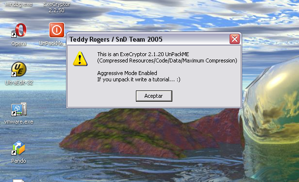

Мы знаем, что это b, он должен быть немного сложнее и мы видим, что задействован агрессивный режим, wow, я уже дрожу, хе-хе.

Давайте, прежде всего, посмотрим, выполняется ли программа в OLLYDBG с конфигурацией, использованной нами прежде, с plugin OLLY ADVANCED и остановкой в system breakpoint для удаления BP, размещаемых OLLYDBG для остановки на EP.

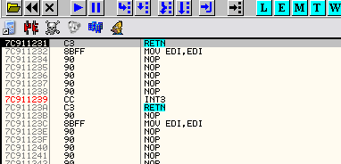

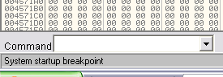

Мы в system breakpoint, перейдем в окно b, чтобы удалить breakpoint, размещаемый OLLYDBG автоматически.

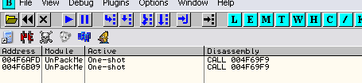

Хорошо, я удаляю их и помещаю BREAK ON EXECUTE в первую секцию, как и раньше

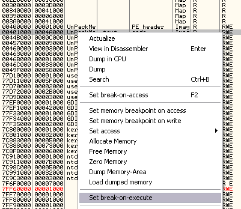

Не забываем, что для этого нами используется plugin OLLYBONE.

Хорошо, давайте сделаем RUN

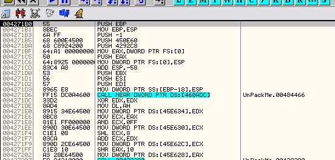

Хорошо, до сих пор различий нет, давайте уберем флажок BREAK ON EXECUTE и остановимся.

Если немного присмотреться, можно заметить, что у нас появилось много threads в сравнении с предыдущим вариантом unpackme, в котором при попадании в OEP их было всего 2.

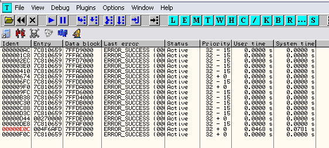

По-видимому, эти потоки, могут выдать меня, если я сделаю что-то не так.

Мы видим, что если я выполняю RUN, crackme выполняется, но это не означает, что они не будут завершать программу при выполнении скрипта, основываясь на данных времени выполнения участков кода и т.д. Давайте посмотрим, что произойдет, если я отменю все threads, кроме текущего, который отмечен красным цветом.

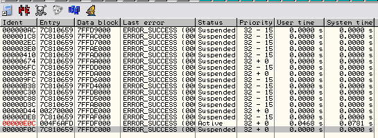

Я кликнул правой кнопкой мыши и выбрал SUSPEND для всех потоков, кроме главного, выделенного красным цветом, программа выполнится все равно? Давайте посмотрим.

Мы видим, что программа остается RUNNING и ничего не происходит.

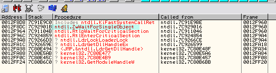

Прервав выполнение и посмотрев в call stack, мы увидим, что находимся в WaitForSingleObject, что говорит нам о том, что поток чего-то ждет и пока другие прерваны, он не продолжит свое выполнение.

Хорошо, чтобы найти тот поток, который ждет программа, давайте выберем RESUME для первого потока и сделаем RUN.

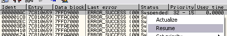

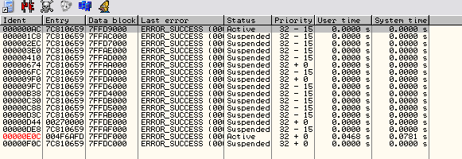

Мы видим, что ничего не происходит и программа по-прежнему имеет статус "RUNNING", сейчас, не прерывая программы, давайте снова остановим первый поток и восстановим второй и так до тех пор, пока не найдем есть ли один, который приведет к выполнению программы.

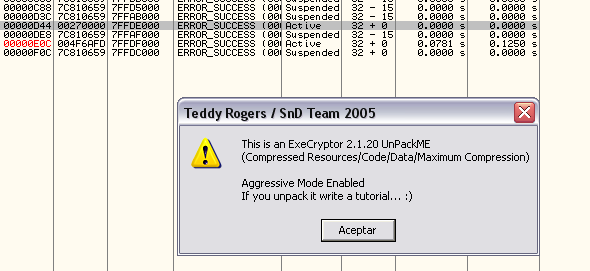

Когда я включаю этот thread, программа выполняется.

Мы видим, что thread - процедура, которая начинается в 270000 на моей машине.

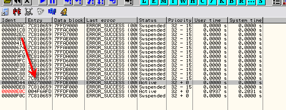

Мы видим, что это просто процедура, находящаяся там

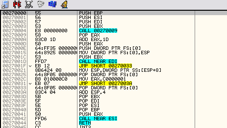

Давайте поместим BPM ON ACCESS в вышеупомянутую секцию

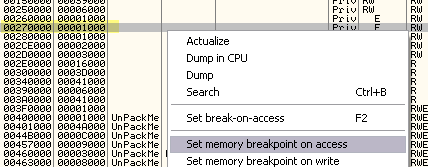

Мы не будем углубляться в исследование работы threads, так как наша задача - ремонт IAT.

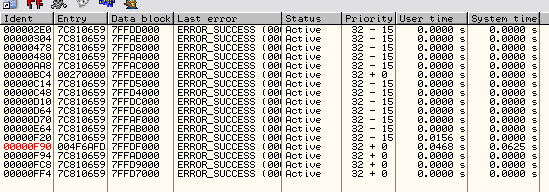

Давайте проверим, будет ли выполняться программа с основным и начинающимся на моей машине в 270000 потоками, так как чем меньше будет вмешательства, тем лучше, если бы не было достаточно двух, нам бы пришлось искать 3-ий или другое минимальное число, другая возможность заключается в поимке вызова ExitProcess с помощью BP, так как программа завершает все потоки, перед выходом, и пытаться продолжить с этого места выполнение скрипта.

Давайте посмотрим, будет ли выполняться программа только с этими двумя потоками

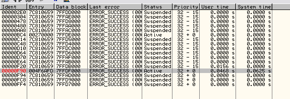

Также бывает полезным обратить внимание на приоритет потока, здесь мы видим, что у второго потока приоритет такой же, как и у первого, хотя есть много других с более низким.

Давайте выполним RUN и посмотрим, что произойдет.

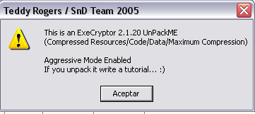

Хорошо, эти два threads - необходимый минимум, требуемый unpackme для выполнения.

Я напоминаю, что при решении этих сложных упаковщиков, не нужно запоминать точные шаги или читать туториалы и думать, что все будет идентичным, так что это не будет туториал по execryptor, скорее здесь показано, как можно приспособиться к неблагоприятным условиям, в которые нас поставили и мои рассуждения по мере решения этого пакера. Смысл заключается в том, чтобы читатель отошел от механического выполнения написанного и начал понимать суть.

Возможно, на другой машине мое решение не приводит к выполнению программы и необходима какая-то дополнительная настройка в случаях, подобных этому, где процедура такая длинная и сложная, что OLLYDBG требуется длинный промежуток времени для трассировки и когда мы не можем контролировать все, что делает пакер, могут быть различия, поэтому читатель должен научиться думать сам, и я бы хотел, чтобы вы изучили с этой статьей больше, чем еще один туториал по execryptor, которых и так много.

Важно научиться импровизировать, думать и приспосабливаться к новым ситуациям, так как execryptor может изменяться и не вписываться схему, которая нами показана,

но тот, кто учится искать собственные решения, может двигаться в новых направлениях и решать эти трудности.

Хорошо, так как я заметил во время предыдущих запусков, что, как и в версии "а", первый адрес в IAT переписывается корректным, я попробую вначале тот же метод, что и в предыдущей части, для этого я помещу BPM ON WRITE в вышеупомянутый адрес и запущу трассировку, которая через длительный промежуток времени завершится при срабатывании BPM в этом участке кода. (файл с трассировкой прилагается к статье)

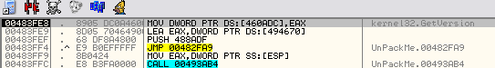

В предыдущем скрипте, чуть повыше в файле трассировки, была инструкция, которая сохраняла в eax верный адрес api и она выполнялась для всех адресов, давайте посмотрим, есть ли она здесь.

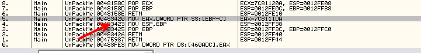

Мы видим, что сейчас эта инструкция расположена в 483420, так что теперь нам необходимо помещать HE ON EXECUTION в адрес 483423, который указывает на следующую инструкцию.

Конечный скрипт предыдущей части был

```assembly
var tabla
var contenido
mov tabla,460818
start:
cmp tabla,460f28
ja final
cmp [tabla],50000000
ja saltear
mov contenido,[tabla]
cmp contenido,0
je saltear
log contenido
log tabla
mov eip,contenido
bphws 47691f, "x"
mov [47691f],0
mov [476920],0
cob reparar
run
reparar:
cmp eip,7c91e88e
je saltear
log eax
mov [tabla],eax
run
saltear:
add tabla,4
jmp start
final:
ret
```

Мы помним, что в предыдущей части адрес, где происходило чтение api, был

>**0047691C Main MOV EAX,DWORD PTR SS:\[EBP-C\] ; EAX=77DA6BF0**
>
>0047691F Main MOV ESP,EBP ; ESP=0012FFB0

в то время как сейчас

>**00483420 > 8B45 F4 MOV EAX,DWORD PTR SS:\[EBP-C\] ; kernel32.GetVersion**
>
>00483423 . |8BE5 MOV ESP,EBP

так что в скрипте мы должны заменить 47691f, который был адресом, где скрипт помещал HE ON EXECUTION, для получения верного адреса в EAX, на 483423 и скрипт примет вид

```assembly
var tabla
var contenido
mov tabla,460818
start:
cmp tabla,460f28
ja final
cmp [tabla],50000000
ja saltear
mov contenido,[tabla]
cmp contenido,0
je saltear
log contenido
log tabla
mov eip,contenido
//483423
bphws 483423, "x"
mov [483423],0
mov [483424],0
cob reparar
run
reparar:
cmp eip,7c91e88e
je saltear
log eax
mov [tabla],eax
run
saltear:
add tabla,4
jmp start
final:
ret
```

Здесь мы меняем адреса, выделенные красным цветом, константы, выделенные синим, а именно начало и конец IAT а также константа 50000000, необходимая для определения, является ли адрес IAT переадресацией или нет, остались прежними, также мы помним о том, что необходимо вручную поставить точку останова в ZwTerminateProcess для того, чтобы каждый раз, когда происходит попытка закрытия программы, мы могли продолжить работу.

Хорошо, давайте перезапустим olly, снова переместимся в OEP, нужно не забыть снять BREAK ON EXECUTE и галочки в DEBUGGING OPTIONS - EXCEPTIONS - MEMORY ACCESS VIOLATION, как в прошлый раз.

Сейчас необходимо не забыть остановить все threads, кроме 2, которые являются необходимыми, прежде чем выполнять скрипт.

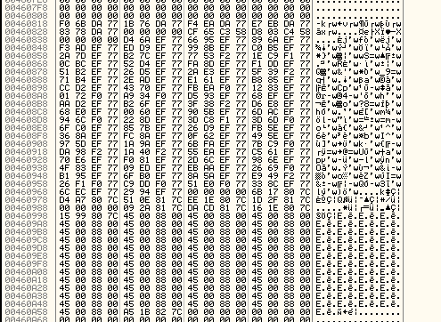

Мы видим, что скрипт хорошо исправляет таблицу, но начиная с определенного адреса, он сохраняет неверное значение.

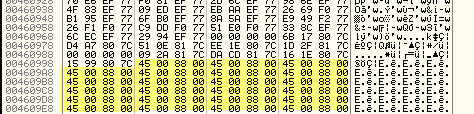

Первый адрес, который вычисляется неверно - это 46099с, давайте посмотрим, какая запись соответствует ему в логе.

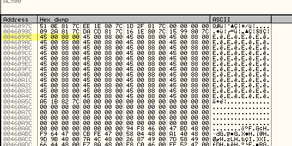

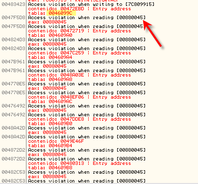

Там мы видим, что начиная с этого адреса, порождается исключение ошибка доступа на чтение адреса 880045, которого раньше не было и которое происходит дальше каждый раз.

Если я изменю скрипт таким образом, чтобы при возникновении исключения он переходил к следующему адресу, ситуация не улучшается и исключение по-прежнему происходит в том же адресе, с той лишь разницей, что теперь не происходит записи в таблицу.

```assembly
reparar:
cmp eip,483423
jne saltear
log eax
mov [tabla],eax
run
```

Что же тут происходит? Неужели вариант b содержит дополнительные хитрости? Давайте посмотрим, где может быть ошибка.

Раньше при обнаружении ошибки происходила попытка закрытия программы, но теперь по логу видно, что не происходит вызовов ZwTerminateProcess, я провоцировал исключение для того, чтобы можно попасть и вернуться из ZWTerminateProcess, но теперь этого не происходит, может всему виной галочка в memory access exception? Давайте посмотрим, что будет, если я ее поставлю и запущу скрипт снова.

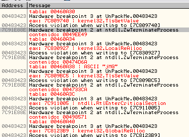

AHHHHHHHHHHHH, сейчас это функционирует как раньше, на каждом адресе порождается исключение из-за ошибки, которую я спровоцировал, и мы попадаем в ZwTerminateProcess и сейчас таблица исправляется, ошибка состояла в том, что не было отмечено memory access.

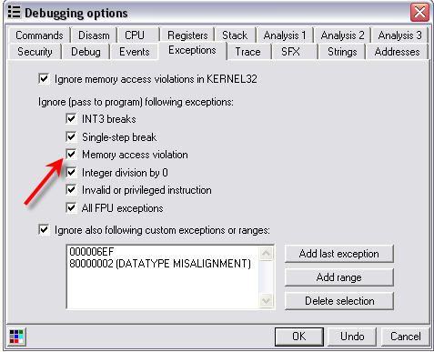

То есть нужно поставить галочку для правильного функционирования скрипта, давайте посмотрим на таблицу.

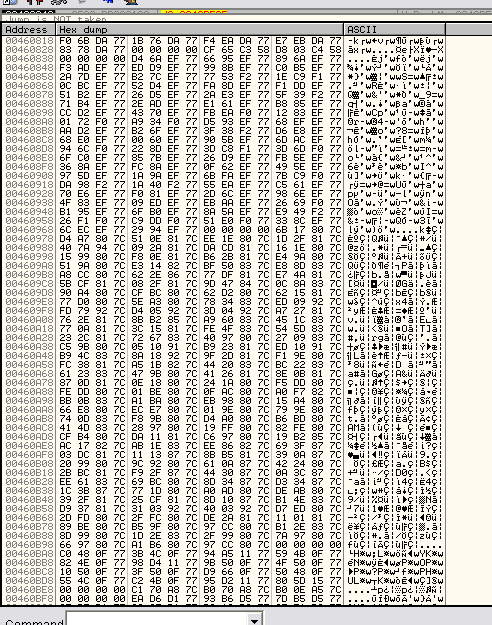

Скрипт принял вид :

```assembly
var tabla
var contenido
mov tabla,460818
start:
cmp tabla,460f28
ja final
cmp [tabla],50000000
ja saltear
mov contenido,[tabla]
cmp contenido,0
je saltear
log contenido
log tabla
mov eip,contenido
bphws 483423, "x"
mov [483423],0
mov [483424],0
cob reparar
run
reparar:
cmp eip,483423
jne saltear
log eax
mov [tabla],eax
run
saltear:
add tabla,4
jmp start
final:
ret
```

(прим. пер. у меня это не заработало, мой вариант в файле 56\_1.osc)

и нужно помнить, что необходимо вручную установить HE on EXECUTION по адресу ZwTerminateProcess перед запуском, поставить галочку в MEMORY ACCESS EXCEPTION и отменять избыточные threads.

Я прибываю в OEP, снимаю BREAK ON EXECUTE, снова обращаю Ваше внимание на то, что должны быть отмечены все галочки исключений, устанавливаю HE ZwTerminateProcess и запускаю скрипт.

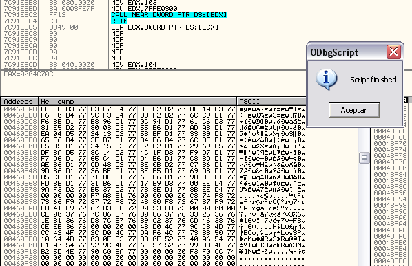

Исправление успешно завершается.

Сейчас я делаю дамп с помощью OLLYDMP и открываю IMP REC.

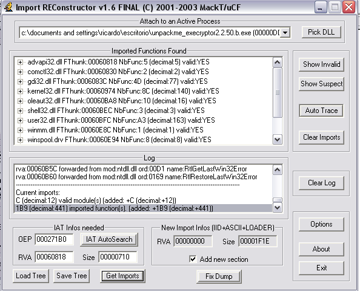

Я вижу, что все адреса исправлены

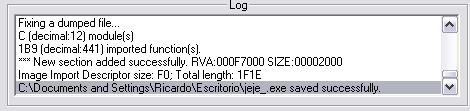

Сейчас я должен исправить TLS, мы открываем dumpeado в OLLY и в header ищем

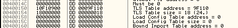

и изменяем на

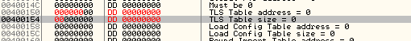

а затем сохраняем изменения

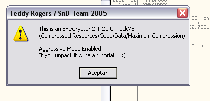

Теперь программа функционирует правильно, хе-хе, в следующей части мы встретимся с c, еще один этап пути пройден.

До встречи в статье 57

\[C\] Рикардо Нарваха, 10.11.06
